# 🚀 End-to-End AWS DevOps CI/CD Pipeline for Java WAR Application

<p align="center">
  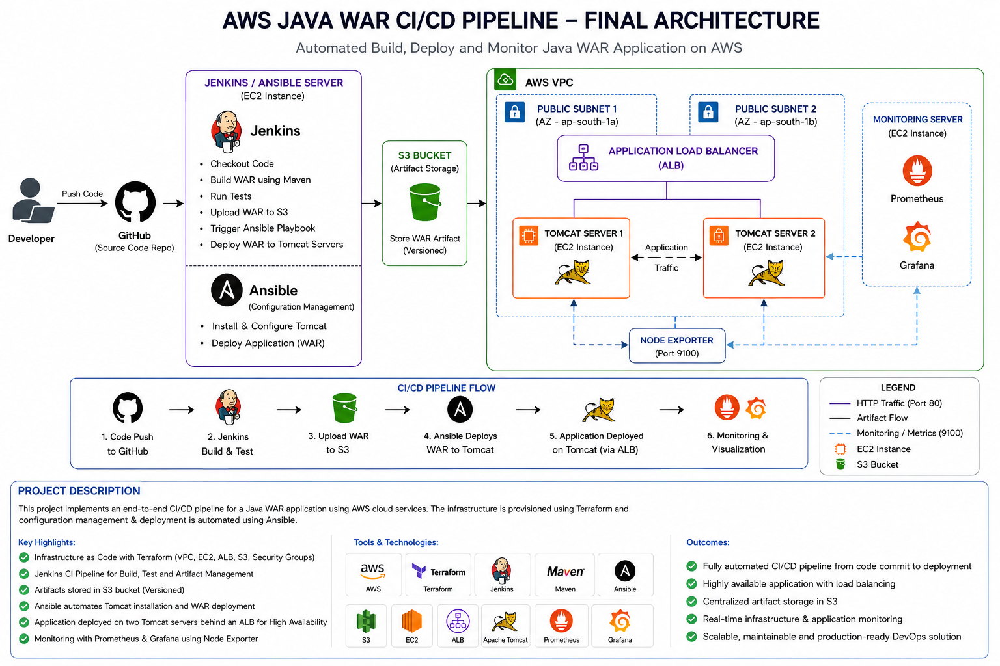
</p>

<p align="center">


</p>

---

# 📌 Project Overview

This project demonstrates an end-to-end DevOps CI/CD pipeline for deploying a Java WAR application on AWS.

The workflow automates infrastructure provisioning, application build, artifact storage, deployment, load balancing, and monitoring using Infrastructure as Code (IaC) and DevOps automation tools.

The pipeline integrates Terraform, Jenkins, Maven, Ansible, Amazon S3, Application Load Balancer (ALB), Prometheus, and Grafana into a complete deployment workflow.

---

# 🎯 Project Objectives

- Provision AWS infrastructure using Terraform
- Configure Jenkins as the CI/CD server
- Build Java WAR applications using Maven
- Store build artifacts in Amazon S3
- Automate application deployment using Ansible
- Deploy the application on multiple Apache Tomcat servers
- Distribute traffic using AWS Application Load Balancer
- Monitor infrastructure using Prometheus and Grafana

---

# 🏗 Project Architecture

<p align="center">

</p>

---

# ⚙️ Tech Stack

| Category | Technologies |
|-----------|--------------|
| Cloud | AWS |
| Infrastructure as Code | Terraform |
| CI/CD | Jenkins |
| Build Tool | Maven |
| Configuration Management | Ansible |
| Application Server | Apache Tomcat |
| Artifact Storage | Amazon S3 |
| Load Balancer | AWS Application Load Balancer |
| Monitoring | Prometheus, Grafana |
| Version Control | Git & GitHub |

---

# ☁️ AWS Infrastructure

The infrastructure is provisioned using reusable Terraform modules.

### Network

- VPC
- 2 Public Subnets
- Internet Gateway
- Route Tables
- Route Table Associations

### Security

- Jenkins Security Group
- Tomcat Security Group
- Monitoring Security Group
- ALB Security Group

### Compute

- Jenkins / Ansible Server
- Tomcat Server 1
- Tomcat Server 2
- Monitoring Server

### Storage

- Amazon S3 Artifact Bucket

### Load Balancing

- Application Load Balancer
- Target Group
- HTTP Listener

---

# 📂 Project Structure

```text
aws-devops-java-cicd-pipeline
│
├── ansible
│   ├── inventory
│   └── playbooks
│
├── docs
│   ├── project screenshots
│
├── jenkins
│   ├── Jenkinsfile
│   └── jenkins.sh
│
├── monitoring
│
├── terraform
│   ├── environments
│   └── modules
│       ├── alb
│       ├── ec2
│       ├── s3
│       ├── security-group
│       └── vpc
│
└── README.md
```

---

# 🔄 CI/CD Workflow

```text
Developer
      │
      ▼
GitHub Repository
      │
      ▼
Jenkins Pipeline
      │
      ▼
Checkout Source Code
      │
      ▼
Build WAR using Maven
      │
      ▼
Upload WAR Artifact to Amazon S3
      │
      ▼
Execute Ansible Playbook
      │
      ▼
Deploy WAR to Apache Tomcat Servers
      │
      ▼
Application Load Balancer
      │
      ▼
Users
      │
      ▼
Prometheus + Grafana Monitoring
```

---

# ✅ Project Features

### Infrastructure Provisioning

- ✅ Modular Terraform Project
- ✅ AWS VPC
- ✅ Public Subnets
- ✅ Internet Gateway
- ✅ Route Tables
- ✅ Security Groups
- ✅ EC2 Instances
- ✅ Amazon S3 Bucket
- ✅ Application Load Balancer

### CI/CD Pipeline

- ✅ Jenkins Installation
- ✅ GitHub Integration
- ✅ Maven Build Automation
- ✅ Jenkins Pipeline
- ✅ WAR Artifact Generation
- ✅ Upload Artifact to Amazon S3

### Configuration Management

- ✅ SSH Configuration
- ✅ Ansible Inventory
- ✅ Automated Apache Tomcat Installation
- ✅ Automated WAR Deployment
- ✅ Multi-Server Deployment

### Application Deployment

- ✅ Java WAR Application Deployment
- ✅ Load Balancing Across Two Tomcat Servers
- ✅ Application Accessible Through ALB

### Monitoring

- ✅ Prometheus Installation
- ✅ Node Exporter Configuration
- ✅ Grafana Dashboard
- ✅ Infrastructure Monitoring

---

# 📸 Project Screenshots

## Project Architecture


---

## Terraform Project Structure

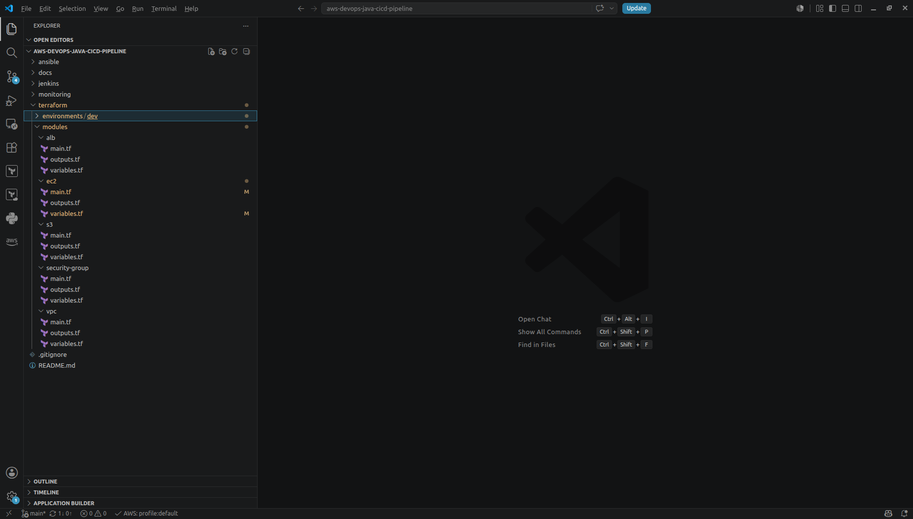

---

## Terraform Infrastructure Deployment

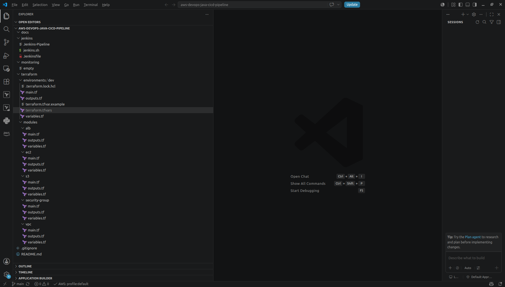

---

## EC2 Instances

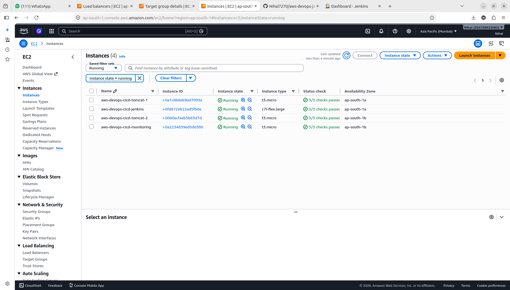

---

## VPC Network Setup

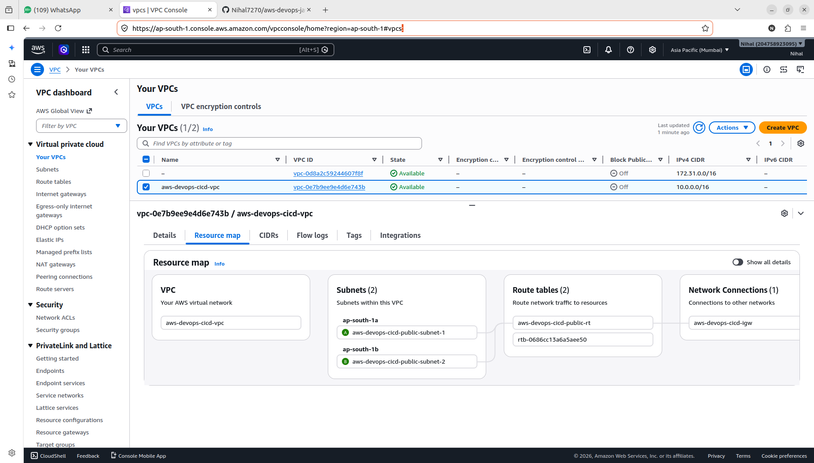

---

## Amazon S3 Artifact Bucket

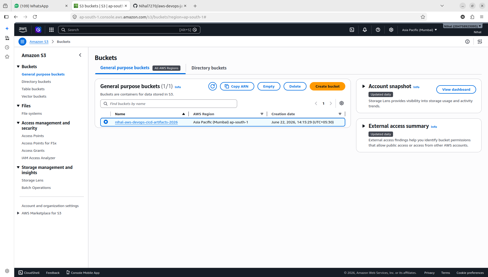

---

## Application Load Balancer

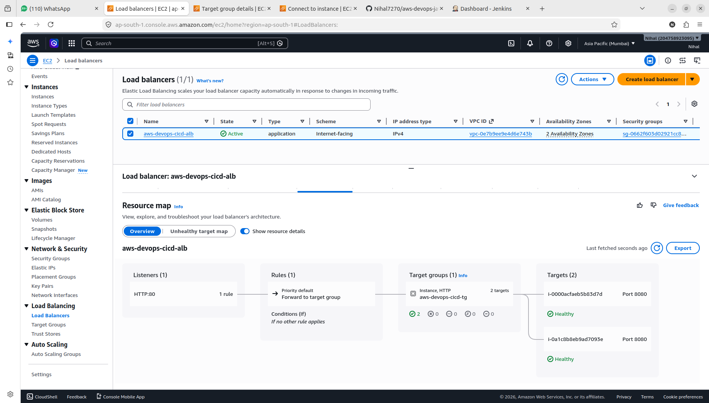

---

## Jenkins Pipeline

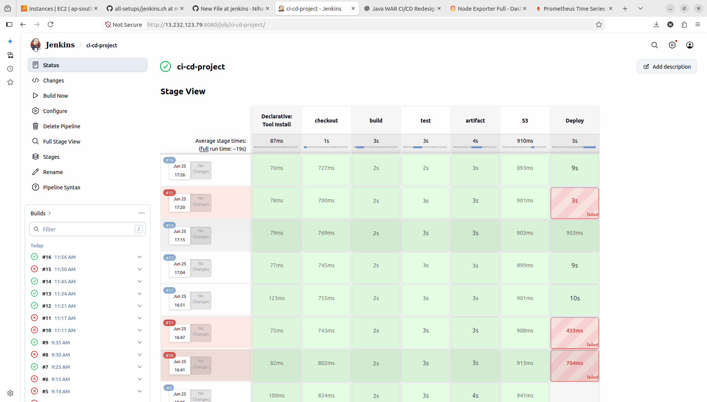

---

## Ansible Deployment

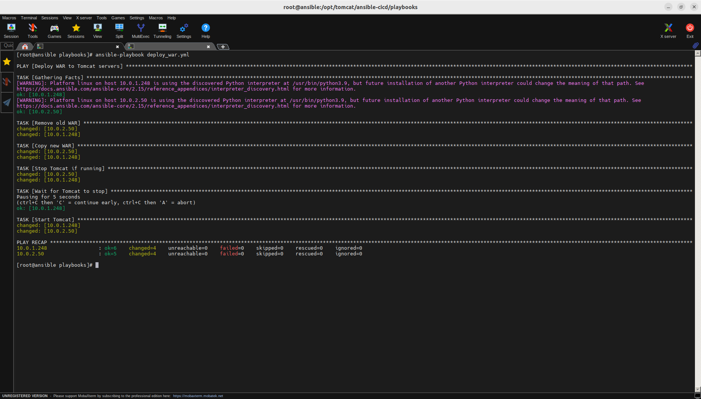

---

## Application Running Through ALB

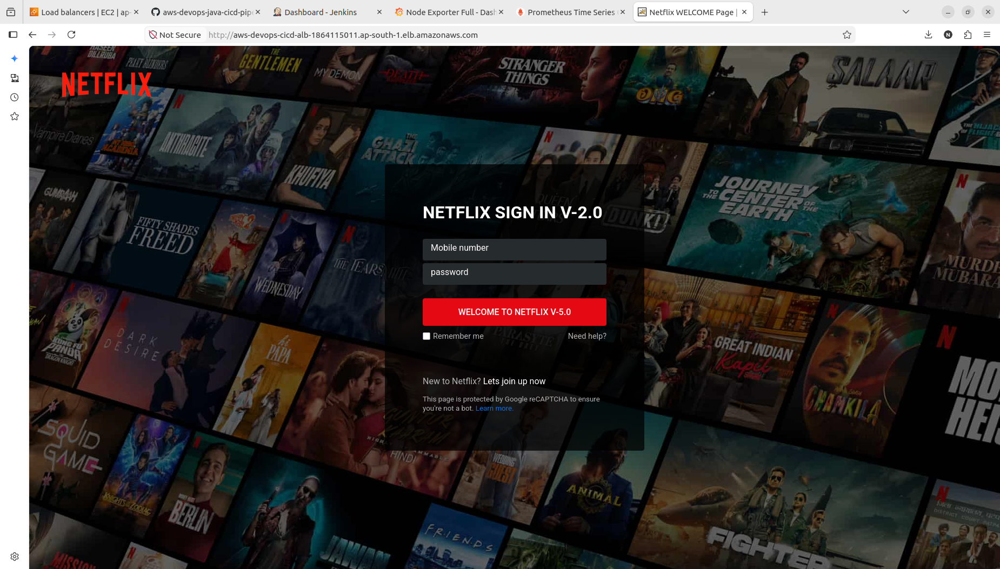

---

## Grafana Dashboard

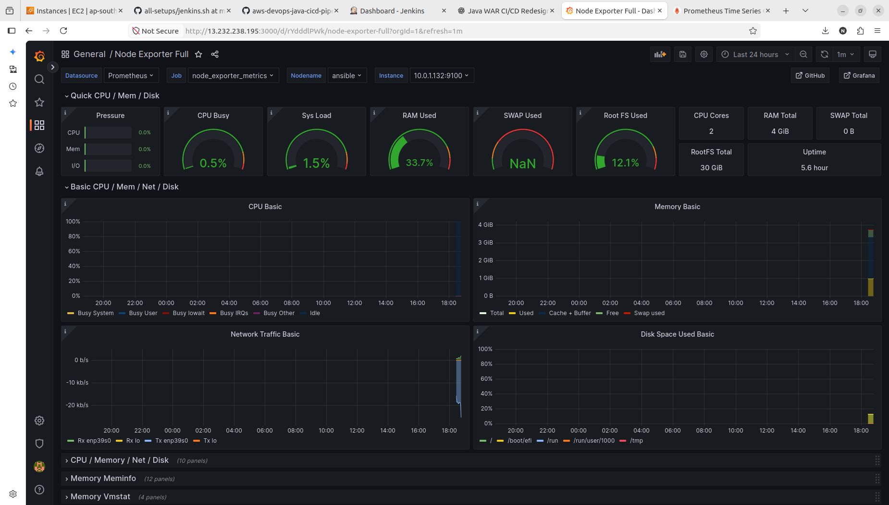

---

## Prometheus Targets

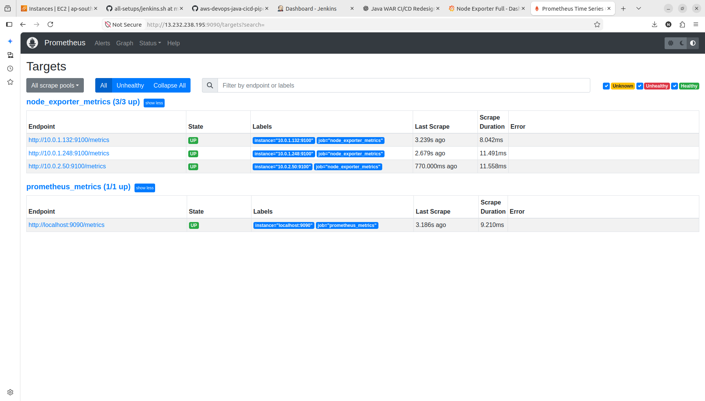

---

# 🐞 Challenges & Learning

During this project, I gained hands-on experience in building and automating a complete DevOps deployment workflow.

Some key learning outcomes include:

- Designing reusable Terraform modules for scalable infrastructure.
- Configuring secure communication between Jenkins, Tomcat servers, Monitoring server, and the Application Load Balancer.
- Integrating GitHub, Jenkins, Maven, Amazon S3, and Ansible into a complete CI/CD pipeline.
- Automating Apache Tomcat installation and WAR deployment using Ansible.
- Configuring ALB target groups and health checks.
- Setting up Prometheus with Node Exporter to collect infrastructure metrics.
- Building Grafana dashboards for infrastructure monitoring.
- Troubleshooting Jenkins pipeline failures, SSH connectivity issues, deployment errors, ALB health checks, and monitoring configuration.

This project helped me understand how multiple DevOps tools work together in a real-world deployment pipeline.

---

# 🚀 Future Improvements

- Configure HTTPS using AWS Certificate Manager (ACM)
- Integrate Amazon Route 53
- Configure Terraform Remote Backend using Amazon S3 and DynamoDB
- Implement Auto Scaling Group (ASG)
- Store application secrets using AWS Secrets Manager
- Implement Blue-Green Deployment Strategy

---

# 👨‍💻 Author

**Nihal Allugula**

- GitHub: https://github.com/Nihal7270
- LinkedIn: https://www.linkedin.com/in/nihal-allugula

---

# ⭐ Support

If you found this project helpful, consider giving the repository a ⭐.
